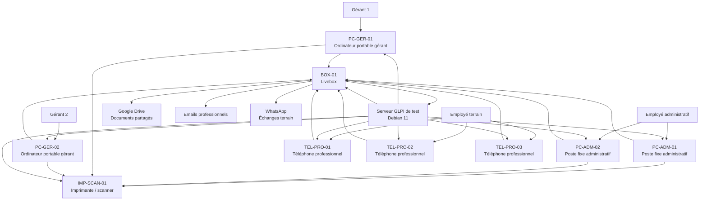

# Schéma du système informatique — GLPI EcoTech

## Objectif

Ce document présente un schéma simple du système informatique d’EcoTech.

L’objectif est de comprendre l’organisation du parc informatique avant l’utilisation de GLPI.

Ce schéma servira à préparer la gestion du parc, des incidents et des demandes dans GLPI.

---

## Contexte

EcoTech est une petite entreprise située à Saint-Pierre, à La Réunion.

L’entreprise utilise plusieurs équipements informatiques :

- 2 PC fixes ;
- 2 PC portables ;
- 2 machines Windows ;
- 2 machines Mac ;
- 3 téléphones professionnels ;
- 1 imprimante / scanner ;
- 1 Livebox classique ;
- des emails professionnels ;
- Google Drive ;
- WhatsApp ;
- un futur serveur GLPI de test.

---

## Schéma simple du SI EcoTech

---

## Lecture du schéma

Les utilisateurs EcoTech utilisent différents équipements selon leur rôle.

Les gérants utilisent principalement les ordinateurs portables.

L’employé administratif utilise les postes fixes pour gérer les documents, devis, factures et échanges internes.

L’employé terrain utilise les téléphones professionnels pour les appels, les photos et les échanges liés aux chantiers.

La Livebox permet l’accès à Internet, aux emails, à Google Drive, à WhatsApp et au serveur GLPI de test.

GLPI permettra de référencer les équipements et de suivre les incidents ou demandes.

---

## Équipements à référencer dans GLPI

| Nom prévu | Type | Usage |
|---|---|---|
| PC-ADM-01 | Ordinateur fixe | Poste administratif |
| PC-ADM-02 | Ordinateur fixe | Poste administratif |
| PC-GER-01 | Ordinateur portable | Gérant 1 |
| PC-GER-02 | Ordinateur portable | Gérant 2 |
| TEL-PRO-01 | Téléphone professionnel | Terrain |
| TEL-PRO-02 | Téléphone professionnel | Terrain |
| TEL-PRO-03 | Téléphone professionnel | Terrain |
| IMP-SCAN-01 | Imprimante / scanner | Impression et numérisation |
| BOX-01 | Équipement réseau | Accès Internet |
| SRV-GLPI-TEST | Serveur de test | GLPI sur Debian 11 |

---

## Services numériques utilisés

| Service | Utilisation |
|---|---|
| Google Drive | Stockage et partage de documents |
| Emails professionnels | Communication avec clients et partenaires |
| WhatsApp | Échanges rapides et photos de chantier |
| GLPI | Gestion du parc, tickets et base de connaissances |
| EcoTech Suivi Chantier | Future application de suivi de chantier |

---

## Limite du schéma

Ce schéma reste volontairement simple.

Il ne représente pas une infrastructure complète d’entreprise avec VLAN, routeur professionnel, serveur physique ou politique réseau avancée.

Il correspond à une petite structure et à une simulation réaliste pour le BTS SIO.